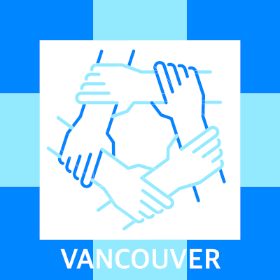

# Cloud Native Vancouver 🇨🇦

We are Cloud Native Vancouver [(CNV)](https://community.cncf.io/vancouver/), an official [chapter](https://github.com/cncf/communitygroups?tab=readme-ov-file) of the Cloud Native Foundation Community Groups. 🕰️

  <picture>
    <source media="(prefers-color-scheme: dark)" height="250px" srcset="./assets/cncf_logo.png">
    <source media="(prefers-color-scheme: light)" height="250px" srcset="./assets/cncf_logo.png">
    
  </picture>

  <a href="https://community.cncf.io/vancouver/">CNCF Community Group</a>
  &nbsp;&nbsp;•&nbsp;&nbsp;
  <a href="https://lu.ma/cloudnativevan">Luma</a>
  &nbsp;&nbsp;•&nbsp;&nbsp;
  <a href="https://discord.gg/vkuZzascDH">Discord (Join us) 🆕</a>
  &nbsp;&nbsp;•&nbsp;&nbsp;
  <a href="https://www.linkedin.com/company/cloudnativevan/">Linkedin</a>

## Values 🚀

Cloud Native Vancouver was created in March 2024, our values are:

1. **Vendor-Neutrality**: As a CNCF Community Group, we maintain strict vendor neutrality to ensure impartiality and foster trust among our members, as part of the CNCF Community Groups we aim to keep ourselves neutral from vendors. [Learn more about vendor neutrality](https://contribute.cncf.io/maintainers/community/vendor-neutrality/)
2. **Community-Centric**: We are committed to serving our community by prioritizing their needs and aspirations. Every initiative and decision aims to deliver meaningful value to our diverse members.
3. **Focused Excellence**: Our focus is on Cloud Native technologies and the advancement of Open Source principles. We strive to provide high-quality, relevant content and discussions that empower our community members.
4. **Diversity and Inclusion**: We actively support underrepresented groups within our community. Embracing diversity enriches our perspectives and strengthens our collective ability to innovate and solve challenges.
5. **Transparency and Accountability**: We operate with transparency in our decisions and actions. Holding ourselves accountable ensures that we maintain the trust and confidence of our community.

## Code of Conduct 📏

Cloud Native Vancouver follows the [CNCF Code of Conduct](https://github.com/cncf/foundation/blob/master/code-of-conduct.md).

## Speaking 🗣️

If you would like to speak at one of our events simply raise a GitHub Issue with your talk proposal ⭐

## Suggestions box 🗳️

If you would like to reach out; you can find our team members on any of the following platforms

[Discord](https://discord.gg/vkuZzascDH) 
[Linkedin](https://www.linkedin.com/company/cloudnativevan/) 
[Email](mailto:cloudnativevan@gmail.com?subject=Test)
